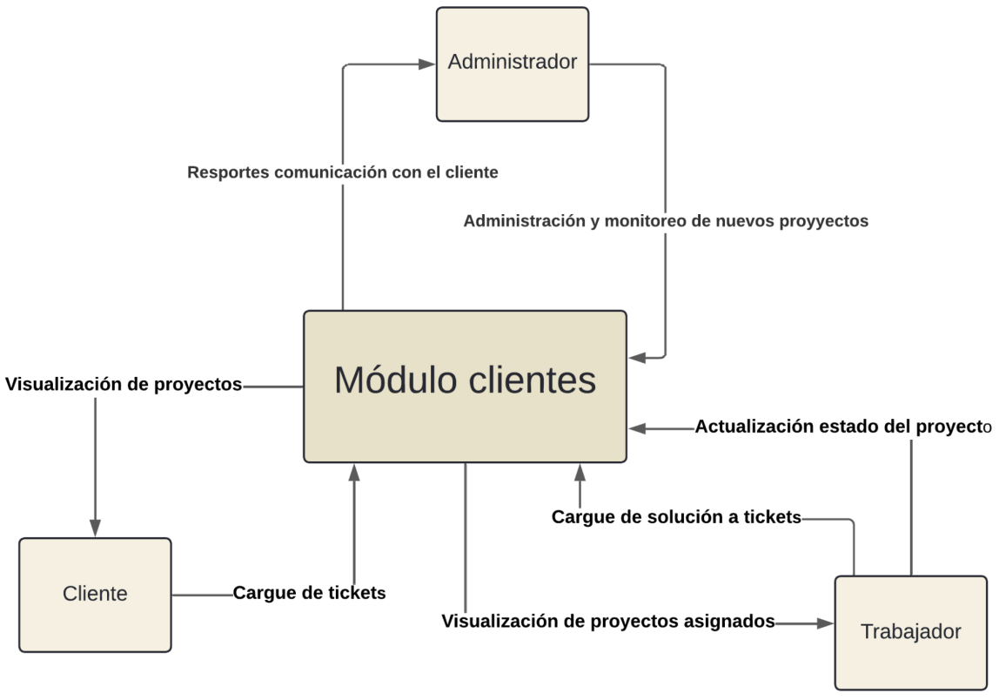
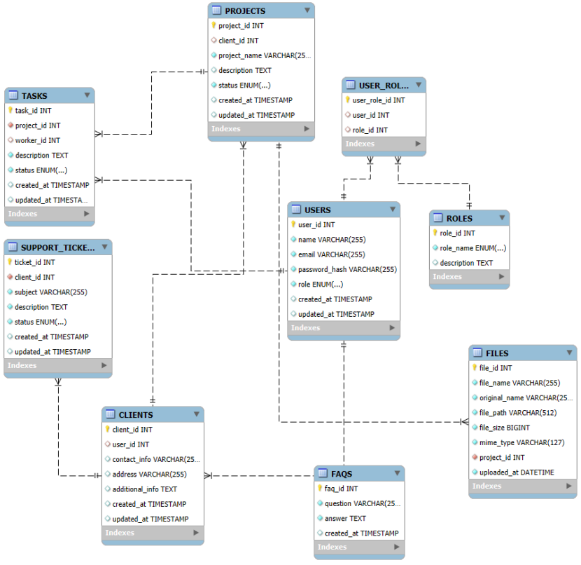
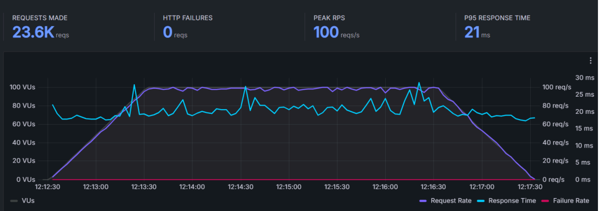
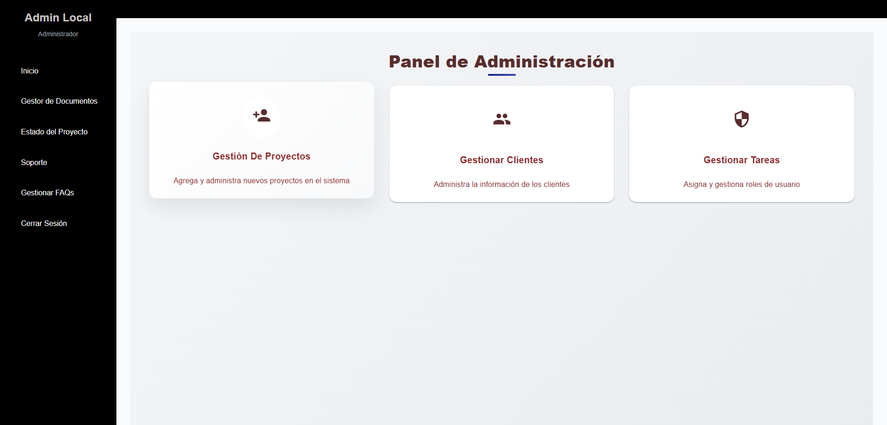
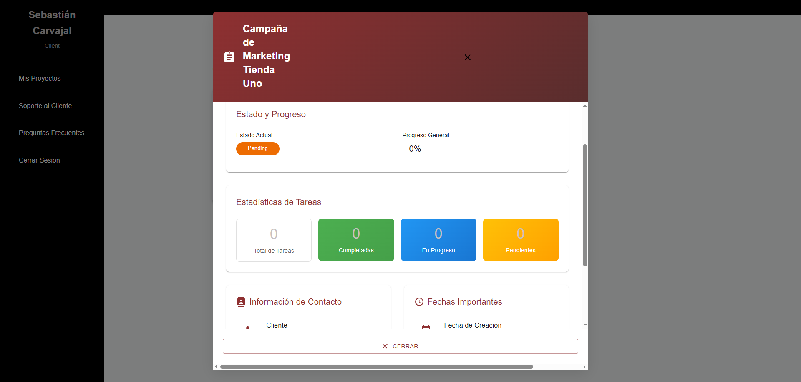
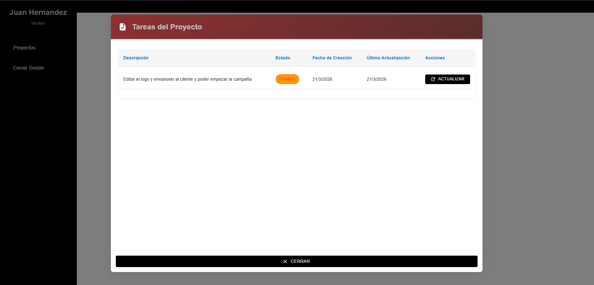

# 🚀 CIMA CRM - Módulo de Gestión de Clientes

> **CRM CIMA | Universidad El Bosque**  
> Desarrollo de la Fase 1 de un sistema Customer Relationship Management (CRM) diseñado para optimizar la gestión de proyectos, tareas y la comunicación con clientes para la empresa CIMA (Centro de Innovación Multimedia y Artística).

---

## Contexto

La empresa CIMA gestionaba sus proyectos, interacciones con clientes y asignación de tareas de forma manual mediante WhatsApp y correos electrónicos. Esto generaba:
* Pérdida de tiempo en la coordinación de reuniones.
* Trazabilidad deficiente de los avances del proyecto.
* Incertidumbre y ansiedad en los clientes respecto al estado de sus servicios.

## La Solución

Se desarrolló un **Módulo de Clientes (CRM)** a la medida, centralizando la información y automatizando la comunicación. El sistema permite a la empresa administrar proyectos y asignar tareas a sus trabajadores, mientras ofrece a los clientes un portal transparente para monitorear el progreso de sus servicios en tiempo real.

---

## Características Principales por Rol

El sistema maneja autenticación segura con JWT y control de acceso basado en 3 roles:

**Administrador**
* Gestión completa (CRUD) de clientes, proyectos y usuarios.
* Asignación de tareas a trabajadores.
* Carga de documentos y gestión de Preguntas Frecuentes (FAQs).
* Dashboard con KPIs y estadísticas de rendimiento general.

**Trabajador (Worker)**
* Visualización exclusiva de proyectos y tareas asignadas.
* Actualización de estados de las tareas: Pendiente, En Progreso, Completado.

**Cliente**
* Acceso transparente al progreso (en porcentaje) de sus proyectos.
* Visualización del estado de las tareas sin necesidad de reuniones de seguimiento.
* Acceso a FAQs y soporte directo.

---

## Arquitectura y Stack Tecnológico

El proyecto fue diseñado bajo una arquitectura de tres capas desacopladas, priorizando la escalabilidad mediante un enfoque **Serverless** en la nube.

* **Frontend:** Construido con React.js, Vite y Material UI. Permite una experiencia de usuario fluida de una sola página (SPA).
* **Backend API:** Node.js y Express gestionado a través de **Serverless Framework**. Desplegado en **AWS Lambda** y **API Gateway** para un modelo de facturación por uso y auto-escalabilidad.
* **Base de Datos:** Modelo relacional implementado en **MySQL**.

### Modelo de Datos

---

## Pruebas de Rendimiento y Resultados

El sistema fue sometido a pruebas de usabilidad y de estrés para garantizar su estabilidad en entornos de producción.

### Pruebas de Carga utilizando Grafana k6
Se simularon escenarios con alta concurrencia de usuarios hacia la API Rest alojada en AWS Lambda:
* **Resultado:** El sistema logró sostener **100 solicitudes por segundo (RPS)** sin interrupciones ni fallos, es decir 0 HTTP Failures.
* **Latencia:** El tiempo de respuesta del percentil 95 (P95) se mantuvo por debajo de los **21 milisegundos**.
  

### Impacto en el Negocio
Tras la implementación con la empresa CIMA, se midieron los siguientes indicadores:
* **+50%** de eficiencia en la gestión de solicitudes de clientes.
* **+40%** de mejora en la rapidez para concluir interacciones.
* **-20%** en la necesidad de agendar reuniones manuales ahorrando tiempo.

---

## Galería del Proyecto

Aquí se muestran algunas de las interfaces clave desarrolladas con React y Material UI.

### Dashboard de Administración

### Vista del Cliente (Transparencia de Proyectos) 

### Gestión de Tareas (Trabajador) 

---

## Metodología Aplicada

Para el desarrollo del proyecto se aplicó un enfoque híbrido:
1. **Design Science Research (DSR):** Metodología académica orientada a la creación de artefactos tecnológicos que resuelven problemas organizacionales reales.
2. **Scrum:** Gestión ágil del ciclo de desarrollo, utilizando Jira y Trello para el control de Sprints y entregables.

---

*Universidad El Bosque - Facultad de Ingeniería - Programa de Ingeniería de Sistemas*